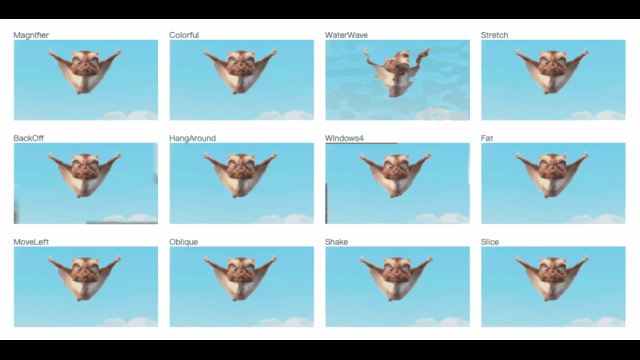

# About animation

> There are many types of animations of `FFCreator`, and scene transition effects can be added

- ## Add `effect` animation

You can add `effect` animation effects to the element (node).
`FFCreator`effect implements most of the functions of the famous css animation library [`animate.css`*4.1.0*](https://animate.style/), which means that you can easily add html animation effects Convert to video film.

### Useage

The animation type can be found here [`animate.css`](https://animate.style/).

```javascript
// parameter - type, time, delay
image.addEffect('fadeInDown', 1, 1);

// another way
image.addEffect({
  type: 'fadeInDown',
  time: 1,
  delay: 1,
});

// Combine multiple animations
text.addEffect(['fadeInUp', 'rotateIn', 'blurIn', 'zoomIn'], 1, 0.5);
```

### Unrealized effect

The following are some of the effects of [`animate.css`](https://animate.style/) not implemented by `FFCreator`, some are not suitable for putting in videos, and some are relatively expensive to implement.

```javascript
- Attention seekers
    - bounce flash pulse rubberBand shakeX shakeY headShake swing tada wobble jello heartBeat
- Fading
    - fadeInTopLeft fadeInTopRight fadeInBottomLeft fadeInBottomRight
    - fadeOutTopLeft fadeOutTopRight fadeOutBottomRight fadeOutBottomLeft
- Flippers
    - flip flipInX flipInY flipOutX flipOutY
- Lightspeed
    - lightSpeedInRight lightSpeedInLeft lightSpeedOutRight lightSpeedOutLeft
- Specials
    - hinge jackInTheBox
```

---

- ## Add custom animation

If you feel that the effect cannot meet your needs, then `FFCreator` also supports any custom animation.
Use the `addAnimate` method to add your custom animation.

### Useage

`addAnimate` supports easing animation from A to B. You can set the `from` and `to` properties.

```javascript
image.addAnimate({
    from: { x:200, scale: .1, opacity: 0 },
    to: { x:100, scale: 1, opacity:1 },
    time = 1,
    delay = 1.2,
    ease = 'Quadratic.In'
});
```

---

- ## Set scene switching effects

Supporting nearly a hundred kinds of cool scene switching effects is a feature of `FFCreator`, all effects are written by `glsl` and the processing speed is extremely fast.



### Useage

```javascript
scene.setDuration(5);
// Two ways to use
scene.setTransition('TricolorCircle', 1.5); // type, duration, params
// or
scene.setTransition({
  name: 'TricolorCircle',
  duration: 1.5,
  params: {},
});
```

### effects animation

The names of all special effects are as follows:

`Magnifier` `Colorful` `WaterWave` `Stretch` `BackOff` `HangAround` `Windows4` `Fat` `MoveLeft` `Oblique` `Shake` `Slice` `Tetrapod` `ZoomRight` `FastSwitch` `Fluidly` `Lens` `Radiation` `TricolorCircle` `WindowShades` `Bounce` `BowTieHorizontal` `BowTieVertical` `ButterflyWaveScrawler` `CircleCrop` `ColourDistance` `CrazyParametricFun` `CrossZoom` `Directional` `DoomScreenTransition` `Dreamy` `DreamyZoom` `FilmBurn` `GlitchDisplace` `GlitchMemories` `GridFlip` `InvertedPageCurl` `LinearBlur` `Mosaic` `PolkaDotsCurtain` `Radial` `SimpleZoom` `StereoViewer` `Swirl` `ZoomInCircles` `angular` `burn` `cannabisleaf` `circle` `circleopen` `colorphase` `crosshatch` `crosswarp` `cube` `directionalwarp` `directionalwipe` `displacement` `doorway` `fade` `fadecolor` `fadegrayscale` `flyeye` `heart` `hexagonalize` `kaleidoscope` `luma` `luminance_melt` `morph` `multiply_blend` `perlin` `pinwheel` `pixelize` `polar_function` `randomsquares` `ripple` `rotate_scale_fade` `squareswire` `squeeze` `swap` `undulatingBurnOut` `wind` `windowblinds` `windowslice` `wipeDown` `wipeLeft` `wipeRight` `wipeUp` `Sunflower`
