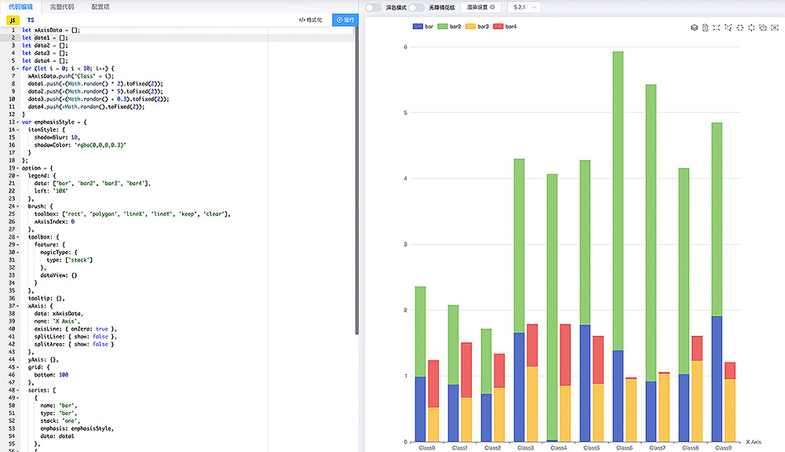

# 数据可视化视频

> `FFCreator6.0`新增 FFChart 组件, 并且支持[echarts.js](https://echarts.apache.org)大部分 demo, 您可以制作炫酷的数据可视化视频。

<video controls="controls" width="320" height="568" >
  <source type="video/mp4" src="./_media/video/wonder/chart.mp4"></source>
</video>

- ## 添加图表组件

`FFCreator6.0`新增 FFChart 组件, 并且支持[echarts.js](https://echarts.apache.org)大部分 demo。当然由于技术差异目前依然有很多图表没有支持, 如果你发现不能使用请告诉我。

> 注: 为了保持版本的稳定性, 当前 FFCreator 使用的 echarts.js 版本固定为[`v5.1.2`](https://www.npmjs.com/package/echarts/v/5.1.2)。

### 复制配置代码

到 echart.js 官方网址 demo 页 https://echarts.apache.org/examples/zh/index.html 下找到你想要的图表, 打开[编辑](https://echarts.apache.org/examples/zh/editor.html?c=bar-brush)页面复制当中的配置代码。



```javascript
const option = {
  xAxis: {
    type: 'category',
    data: ['Mon', 'Tue', 'Wed', 'Thu', 'Fri', 'Sat', 'Sun']
  },
  ...
  series: [
    {
      data: [120, 200, 150, 80, 70, 110, 130],
      type: 'bar'
    }
  ]
};
```

### 添加图表组件

> 注: 因为视频和 web 的显示区别, 所以请重新设置边间距和字号等选项以达到最佳效果

初始化`FFChart`并且设置`option`以及`theme`主题, 这里可以参考 https://echarts.apache.org/zh/api.html 官方文档。

```javascript
const fchart = new FFChart({
  theme: 'dark',
  option: option,
  x: width / 2,
  y: height / 2 + 50,
  width: 700,
  height: 600,
});
```

也可以使用`setOption`方法设置数据

```javascript
fchart.setOption(option);
fchart.addEffect(['rotateIn', 'zoomIn'], 1.2, 1);
```

一个DEMO的源代码 [https://github.com/tnfe/FFCreator/blob/master/examples/chart.js](https://github.com/tnfe/FFCreator/blob/master/examples/chart.js)

### 动态图表

如何给`FFChart`增加动画呢? `FFChart`提供了`update`方法来更新数据, 它是一个定时执行函数其作用类似于`setInterval`。你可以传入一个更新钩子函数, 第二个参数为间隔时间。

> 注: 这里还要注意调整`animationDuration`以及`animationDurationUpdate`等选项的数值, 来和`updateTime`保持步调一直。

```javascript
fchart.update(chart => {
  const newData = ...;
  ...
  chart.setOption(newData);
}, 1000);
```

### 立刻动画

当然你还会发现一个问题, 就是调用了 update 但是动画并没有立刻执行。这是因为`update`是定时间隔函数并不会立即去调用钩子函数执行。当然很多时候用户想要的就是这种效果。

如果想要立刻执行图表动画, 那么请调用`updateNow`

```javascript
fchart.update(() => {}, 1000);
fchart.updateNow();
```
