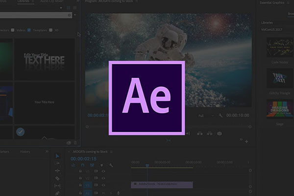
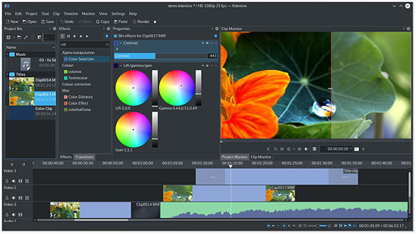

# 方案对比

> 本文不讨论 `app`(ios、安卓)短视频 SDK 的相关技术

今天随便打开一个应用市场都会发现短视频类的 app 已经铺天盖地, 但是短视频生产的整套技术解决方案对大多数普通开发来说依然并不简单。
网络上对于相关技术的专业文章数量非常少, 并且大多数公司也不会把他们的核心 sdk 对外开源。

这里我们就对比几种常见的技术方案和`FFCreator`的差异, 但是要注明的是其他的解决方案远不止与这几种, 而且当中也许还会有更加优秀的思路和方案。

## 解决方案

- #### `aerender.exe` - 基于`AE`模版的自动化渲染方案

大家对基于默认模版上传图片拼合一个视频相册的小程序应该都不陌生, 这类的产品现在层出不穷. 其中很多就是基于`aerender`方案开发的。

`After Effects`这款专业而又强大的视频编辑软件专门为开发者提供了一个用于自动化批量处理的工具`aerender.exe`(详见[文章](https://helpx.adobe.com/cn/after-effects/user-guide.html/cn/after-effects/using/automated-rendering-network-rendering.ug.html))。

使用`aerender.exe`或者基于`aerender.exe`、`ffmpeg`、`opengl`等技术结合, 就可开发出当下火爆的相册影集应用。
(相关的技术文章 [文章一](http://www.360doc.com/content/20/0506/03/36367108_910463236.shtml)、[文章二](https://www.jianshu.com/p/dc7ba3c78180))

##### ✔ 方案优点

因为`After Effects`是非常专业的视频软件, 所以设计师(开发通常不会)可以基于`AE`创作出很酷炫的模版, 再使用这些模版替换占位来生成用户需要的视频。
定制化强、商业模版丰富、大量酷炫特效插件, 是一种很不错的解决方案。

##### ✘ 方案缺点

目前自动化工具只有`windows`版本(`aerender.exe`), 这就意味着您只能使用`windows server`而不能使用`linux`服务器及其之下的强大运维工具。
同时在单机上`aerender.exe`的视频渲染速度并不快, 耗时甚至是`FFCreator`的 3-5 倍以上。还有这种基于固定模版的方式, 不能支持类似可视化搭建视频的非定制需求。

---

- #### MLT(`MLT Multimedia Framework`)多媒体框架

MLT 是一个开源的多媒体框架，为广播电视频而生。它给广播、视频编辑器、媒体播放器、转码器、网络流化等很多应用提供了一个底层工具。系统的功能是通过提供各式各样的工具集、XML 编辑组件和一组基于可扩展插件的 API 来实现。
[https://www.mltframework.org/](https://www.mltframework.org/)

##### ✔ 方案优点

支持`command`命令行调用, 同时它封装了`FFmpeg，JACK，Movit，SOX，libvorbis`等库, 功能比较丰富可以制作酷炫的视频动画。设计师也可以创建默认模版并替换占位来生成用户需要的视频。

##### ✘ 方案缺点

模版制作比较复杂, 无法直接使用 AE 模版文件(需要先将 AE 的特效转成 MLT 的 XML 格式)。同时加工速度也不是非常快(比 AE 方案快), 要高速制作需要很多优化办法。
还有该软件并不是很热门所以相关学习资料不多, 对新手来说上手困难可能比较大。搭建和安装流程并不简单, 对于中小型项目来说这也显得比较重。

---

- #### `FFCreator`方案

`FFCreator`使用`opengl`来处理图形渲染并使用`shader`后处理来生成转场效果，最后使用`FFmpeg`合成视频，基于`opengl`既十分高效又可以支持各种丰富的图形动画。
如果更简单的需求还可以使用更加简单版的`FFCreatorLite`, 几乎没有依赖并且处理速度更快。

##### ✔ 方案优点

跨平台解决方案, `linux`、`windows`下都可以使用。`FFCreator`视频合成速度极快, 一般 5-7 分钟的视频只需 1.5 分钟左右即可合成。
基于`node.js`开发上手成本很低, 对于前端工程师来说是非常适合的解决方案。既可以创建默认视频模版, 又可以根据即时数据自由组合动画。

##### ✘ 方案缺点

没有像`After Effects`这种专业视频软件有更多的特效和动态插件, 同时也没有像`AE`、`PR`的可视化界面让开发同学方便的创建视频模版(但是编码开发也很快)。
